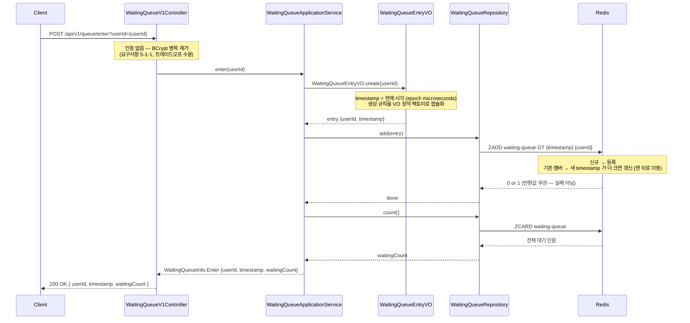
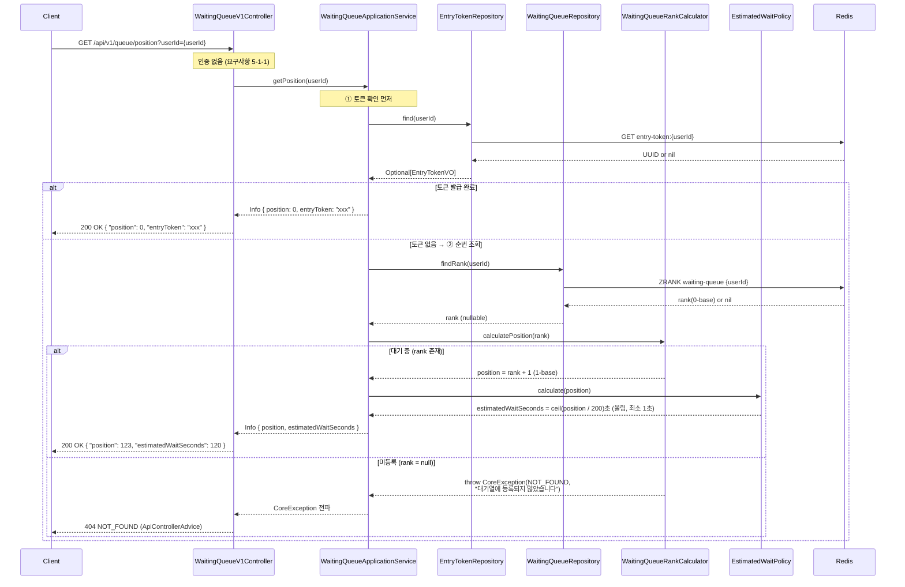
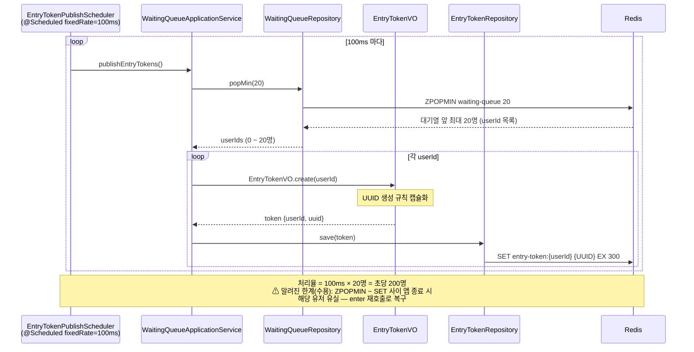
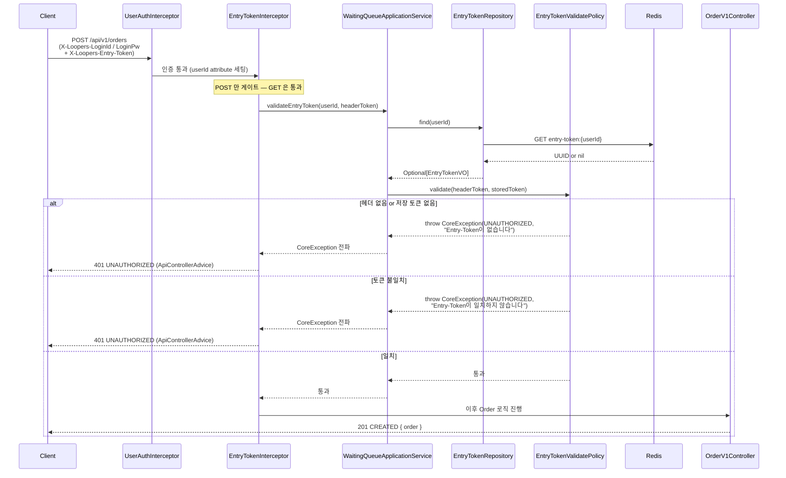
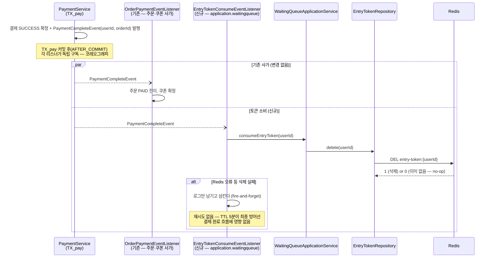

# WaitingQueue 도메인 다이어그램

- 작성일: 2026-07-08
- 수정일: 2026-07-09 — 주문 시 Entry-Token 검증(1-4) 추가
- 수정일: 2026-07-10 — 결제 완료 시 Entry-Token 소비(1-5) 추가
- 수정일: 2026-07-10 — enter 응답에 전체 대기 인원(waitingCount) 추가 (1-1)
- 기준 문서: [01-requirements.md](01-requirements.md)

---

## 1. 시퀀스 다이어그램

### 1-1. POST /api/v1/queue/enter — 대기열 진입

- 토큰 보유 여부를 확인하지 않고 **무조건 ZADD(GT)** 한다. (공정성 — 토큰 보유자도 새 구매는 다시 줄을 선다)
- ZADD 반환값 0(기존 멤버)이어도 score 는 갱신되므로 실패로 취급하지 않는다.
- `waitingCount` 는 ZADD 직후의 **스냅샷** — ZADD~ZCARD 사이 스케줄러 ZPOPMIN 이 개입할 수 있으나 진입 직후 안내용 UX 값으로 충분하다.

### 1-2. GET /api/v1/queue/position — 순번 확인 (폴링)

### 1-3. EntryTokenPublishScheduler — 토큰 발급 (100ms 주기)

### 1-4. POST /api/v1/orders — 주문 시 Entry-Token 검증

- 토큰은 검증만 하고 **삭제하지 않는다** — 소비는 결제 완료 이벤트에서 처리한다 (1-5). 결제 실패 시 TTL 5분 내 재사용(주문 재생성) 허용.
- 인터셉터 순서: `UserAuthInterceptor` → `EntryTokenInterceptor`. userId 는 앞선 인터셉터가 세팅한 request attribute 에서 가져온다.

### 1-5. 결제 완료 시 Entry-Token 소비 (코레오그래피)

- **코레오그래피 방식**: 중앙 조율자 없이 `OrderPaymentEventListener`(주문·쿠폰)와 `EntryTokenConsumeEventListener`(대기열 토큰)가 같은 이벤트를 각자 구독해 독립적으로 반응한다. 두 리스너는 서로의 성공/실패에 영향을 주지 않는다.
- `PaymentFailedEvent` 는 구독하지 않는다 — 결제 실패 시 토큰이 유지되어 TTL 내 재시도가 가능하다.
- 결제 성공 후 5분 내 재주문은 토큰이 삭제된 상태이므로 다시 대기열에 진입해야 한다 (1회 입장권 = 1회 결제).
- **수용한 경쟁 조건**: 토큰 삭제와 동시에 같은 유저가 그 토큰으로 새 주문 검증을 통과할 수 있는 밀리초 단위 창이 있으나, 실질적 피해가 없어 방어하지 않는다.

---

## 2. 클래스 다이어그램

```mermaid
classDiagram
    direction TB

    class WaitingQueueV1Controller {
        -WaitingQueueApplicationService applicationService
        +enter(userId) ApiResponse~EnterResponse~
        +getPosition(userId) ApiResponse~PositionResponse~
    }
    note for WaitingQueueV1Controller "인증 없음 — userId 쿼리 파라미터 (요구사항 5-1-1)"

    class WaitingQueueV1Dto {
        <<record>>
        EnterResponse(userId, timestamp, waitingCount)
        PositionResponse(position, estimatedWaitSeconds, entryToken)
    }

    class WaitingQueueApplicationService {
        -WaitingQueueRepository waitingQueueRepository
        -EntryTokenRepository entryTokenRepository
        -WaitingQueueRankCalculator rankCalculator
        -EstimatedWaitPolicy estimatedWaitPolicy
        +enter(userId) WaitingQueueInfo.Enter
        +getPosition(userId) WaitingQueueInfo.Position
        +publishEntryTokens() void
        +validateEntryToken(userId, headerToken) void
        +consumeEntryToken(userId) void
    }

    class EntryTokenConsumeEventListener {
        -WaitingQueueApplicationService applicationService
        +onPaymentSucceeded(event) void  AFTER_COMMIT + Async
    }

    class EntryTokenInterceptor {
        -WaitingQueueApplicationService applicationService
        +preHandle(request) boolean  POST /api/v1/orders 게이트
    }

    class EntryTokenValidatePolicy {
        +validate(headerToken, storedToken) void
    }

    class WaitingQueueInfo {
        <<record>>
        Enter(userId, timestamp, waitingCount)
        Position(position, estimatedWaitSeconds, entryToken)
    }

    class EntryTokenPublishScheduler {
        -WaitingQueueApplicationService applicationService
        +publish() void  ⏱ fixedRate=100ms
    }

    class WaitingQueueEntryVO {
        <<record>>
        +String userId
        +long timestamp
        +create(userId)$ WaitingQueueEntryVO
    }

    class EntryTokenVO {
        <<record>>
        +String userId
        +String token
        +create(userId)$ EntryTokenVO
    }

    class WaitingQueueRankCalculator {
        +calculatePosition(rank) long
    }

    class EstimatedWaitPolicy {
        +calculate(position) long
    }

    class WaitingQueueRepository {
        <<interface>>
        +add(entry) void
        +findRank(userId) Optional~Long~
        +popMin(count) List~String~
        +count() long
    }

    class EntryTokenRepository {
        <<interface>>
        +find(userId) Optional~EntryTokenVO~
        +save(token) void
        +delete(userId) void
    }

    class WaitingQueueRepositoryImpl {
        -RedisTemplate redisTemplate
        +add(entry) void  ZADD GT
        +findRank(userId) Optional~Long~  ZRANK
        +popMin(count) List~String~  ZPOPMIN
        +count() long  ZCARD
    }

    class EntryTokenRepositoryImpl {
        -RedisTemplate redisTemplate
        +find(userId) Optional~EntryTokenVO~  GET
        +save(token) void  SET EX 300
        +delete(userId) void  DEL
    }

    WaitingQueueV1Controller --> WaitingQueueApplicationService
    WaitingQueueV1Controller ..> WaitingQueueV1Dto
    EntryTokenPublishScheduler --> WaitingQueueApplicationService
    EntryTokenInterceptor --> WaitingQueueApplicationService
    EntryTokenConsumeEventListener --> WaitingQueueApplicationService

    WaitingQueueApplicationService ..> WaitingQueueInfo
    WaitingQueueApplicationService --> WaitingQueueRepository
    WaitingQueueApplicationService --> EntryTokenRepository
    WaitingQueueApplicationService --> WaitingQueueRankCalculator
    WaitingQueueApplicationService --> EstimatedWaitPolicy
    WaitingQueueApplicationService --> EntryTokenValidatePolicy
    WaitingQueueApplicationService ..> WaitingQueueEntryVO
    WaitingQueueApplicationService ..> EntryTokenVO

    WaitingQueueRepositoryImpl ..|> WaitingQueueRepository
    EntryTokenRepositoryImpl ..|> EntryTokenRepository
```

### 레이어 배치

| 레이어 | 클래스 | 비고 |
|--------|--------|------|
| interfaces.api | `WaitingQueueV1Controller`, `WaitingQueueV1Dto` | 표현 계층 |
| interfaces.auth | `EntryTokenInterceptor` | `POST /api/v1/orders` 게이트, `UserAuthInterceptor` 다음 순서 |
| application | `WaitingQueueApplicationService`, `WaitingQueueInfo`, `EntryTokenPublishScheduler`, `EntryTokenConsumeEventListener` | Repository 포트 조합(orchestration), `@Scheduled`, `PaymentCompleteEvent` 구독(AFTER_COMMIT + 비동기) |
| domain (순수 Java) | `WaitingQueueEntryVO`, `EntryTokenVO`, `WaitingQueueRankCalculator`, `EstimatedWaitPolicy`, `EntryTokenValidatePolicy`, `WaitingQueueRepository`, `EntryTokenRepository` | Spring/Redis 무의존 |
| infrastructure | `WaitingQueueRepositoryImpl`, `EntryTokenRepositoryImpl` | RedisTemplate 어댑터 |

- 의존성 방향: interfaces → application → domain ← infrastructure (DIP — 구현체가 도메인 포트를 구현)
- 도메인 계층은 Redis 호출을 직접 하지 않는다. 조합 책임은 `WaitingQueueApplicationService` 에 있다.
