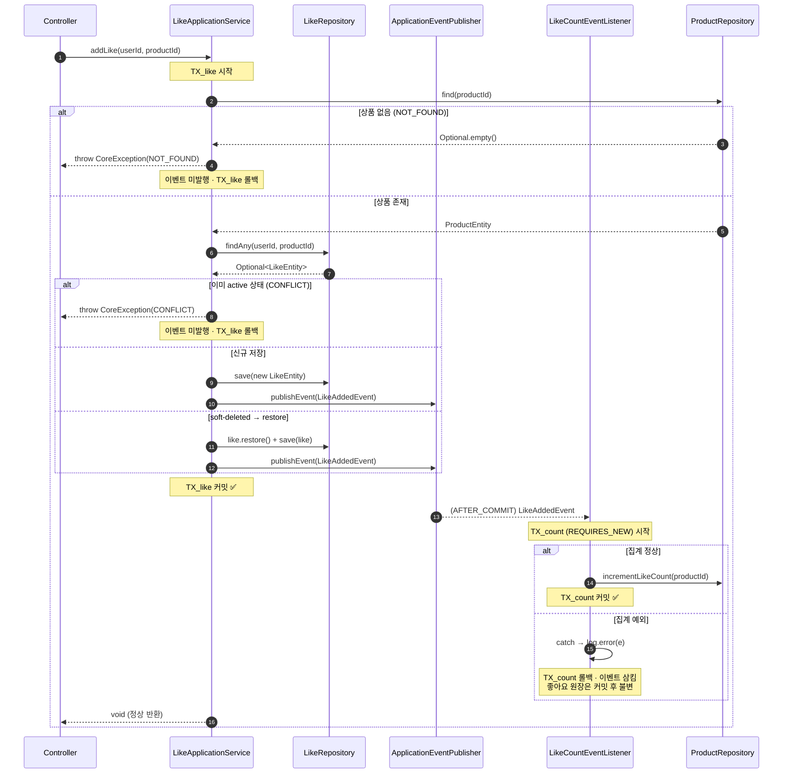
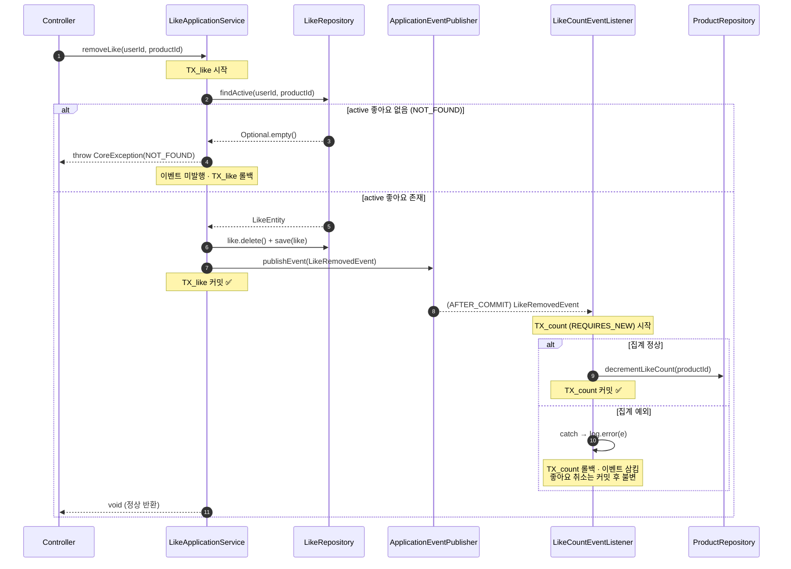
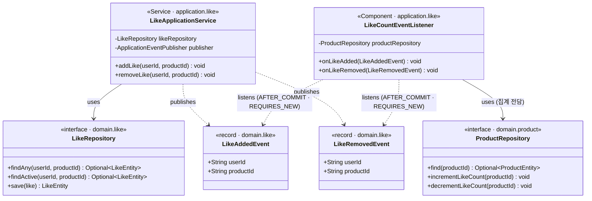

# 좋아요 처리와 집계의 이벤트 기반 분리 — 시퀀스 · 클래스 다이어그램

> 관련: [Design Doc](./2026-07-01-like-count-event-separation.md) · 브랜치: Volume-7

이번 설계의 핵심 리스크는 **트랜잭션 경계와 이벤트 발행/수신 타이밍**에 있다.
"어디까지가 TX_like이고, 이벤트는 언제 나가며, 집계 실패가 좋아요 커밋에 영향을 주지 않는다는 불변식이 어디서 보장되는가"를 아래 다이어그램으로 시각 검증한다.

> **ERD 변경 없음.** `likes` 테이블과 `products.like_count` 컬럼 스키마는 기존 그대로 유지된다.

---

## ① 시퀀스 다이어그램

### 왜 이 다이어그램이 필요한가 / 무엇을 검증하는가

`LikeApplicationService`가 좋아요 원장을 커밋한 뒤 이벤트를 발행하고, `LikeCountEventListener`가
AFTER_COMMIT 이후 독립 트랜잭션(REQUIRES_NEW)에서 집계를 수행한다는 **시간 순서**와 **트랜잭션 경계**를
명확히 표현한다. 특히 "집계 실패 시 좋아요 커밋은 영향을 받지 않는다"는 핵심 불변식과,
예외 경로(CONFLICT / NOT_FOUND)에서 이벤트가 발행되지 않는다는 계약을 검증한다.

### addLike — 정상 경로 + 집계 실패 경로

### removeLike — 정상 경로 + 집계 실패 경로

### 시퀀스 다이어그램 읽는 법 + 특히 봐야 할 포인트

- **`TX_like 커밋 ✅` 이후 `AFTER_COMMIT` 화살표까지가 핵심 불변식 경계다.**
  이벤트는 반드시 커밋 성공 이후에만 발행되므로, 좋아요가 롤백된 채로 집계가 실행되는 경우가 없다.
- **예외 경로(NOT_FOUND, CONFLICT)는 커밋에 도달하지 않는다.**
  `publishEvent` 호출 자체가 이뤄지지 않기 때문에 리스너가 트리거될 여지가 없다. 다이어그램에서 두 경로 모두 `TX_like 커밋` Note 이전에 종료됨을 확인할 수 있다.
- **집계 실패 `else` 구간에서 void 반환이 이미 이뤄진 뒤다.**
  AFTER_COMMIT 리스너는 동기 실행이지만 예외를 삼키므로, 컨트롤러가 받는 응답은 집계 성공 여부와 무관하게 항상 정상(`200 OK`)이다. 이것이 "좋아요는 확실히 기록된다"는 유저 스토리의 구현 방식이다.

---

## ② 클래스 다이어그램

### 왜 이 다이어그램이 필요한가 / 무엇을 검증하는가

명령(Command)과 집계(Event) 책임의 **패키지·클래스 단위 분리**를 확인한다.
`LikeApplicationService`가 `ProductRepository`를 직접 의존하지 않고 이벤트로 위임한다는 구조,
그리고 `LikeCountEventListener`가 집계만을 전담하는 독립 컴포넌트로 존재한다는 설계를 검증한다.

### 클래스 다이어그램 읽는 법 + 특히 봐야 할 포인트

- **`LikeApplicationService`와 `ProductRepository` 사이에 직접 의존선이 없다.**
  `addLike/removeLike`는 좋아요 원장 저장과 이벤트 발행만 책임지고, 집계 구현(`incrementLikeCount`)을 알지 못한다. 점선 화살표(publishes)와 실선 화살표(uses)의 분리가 Command/Event 경계를 시각적으로 표현한다.
- **`LikeCountEventListener`가 `ProductRepository`를 단독으로 소유한다(집계 전담).**
  향후 좋아요 이벤트에 알림·행동 로깅 등 부가 관심사를 붙이려면 별도 리스너를 추가하기만 하면 되며, `LikeApplicationService`를 건드릴 필요가 없다. 이것이 "확장성" 비기능 요구사항의 설계적 근거다.
- **이벤트 클래스(record)는 `domain.like`에 위치해 application 계층 양쪽에서 참조 가능하다.**
  발행자(`LikeApplicationService`)와 수신자(`LikeCountEventListener`) 모두 `application.like`에 있고, 이벤트 페이로드는 `domain.like`에 있어 의존 방향이 안쪽(domain)으로만 향하는 레이어드 규칙을 준수한다.
