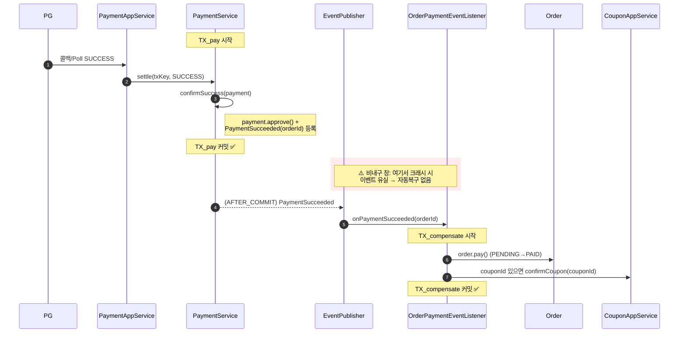
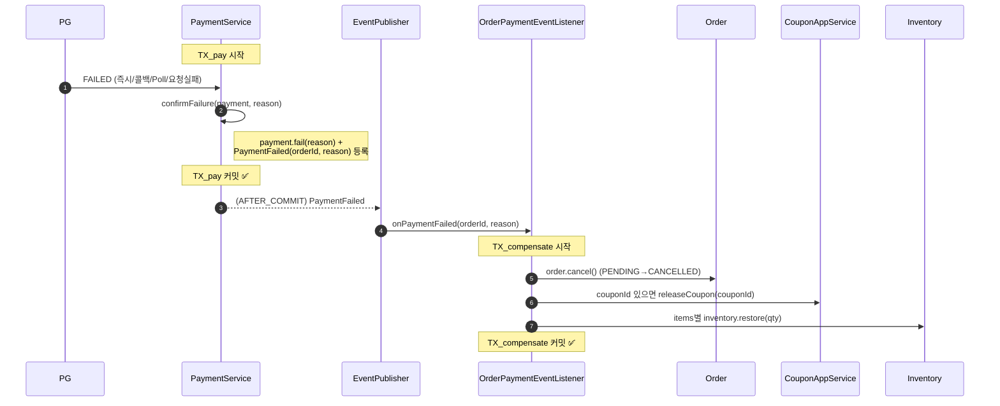

# 결제 이벤트 기반 보상 — 시퀀스 다이어그램 (Phase C)

> 관련: [Design Doc](./2026-07-01-payment-event-compensation.md) · [ADR-036](../adr/036-payment-event-compensation.md)

이번 설계의 리스크는 전부 **트랜잭션 경계와 이벤트 발행/수신 순서**에 있다(확정=발행 불변식, AFTER_COMMIT 비내구 창, 보상 조율). 아래 시퀀스로 "어디까지가 한 TX이고, 이벤트가 언제 나가며, 유실 창이 어디인지"를 시각 검증한다.

## ① 결제 성공 경로

**봐야 할 포인트:**
- `TX_pay`(결제 확정+이벤트 등록)와 `TX_compensate`(주문/쿠폰)가 **완전 분리**. 이벤트는 `TX_pay` 커밋 후(AFTER_COMMIT) 발행되므로 결제 롤백 시 이벤트도 발행되지 않는다(확정=발행 불변식).
- **빨간 구간 = 비내구 창.** `settle`의 first-wins 멱등 때문에 재-Poll로도 메울 수 없다 → ADR-036의 성공 경로 심각 리스크. Outbox 도입 전까지 감수.
- `confirmSuccess`가 `approve()`와 이벤트 등록을 한 곳에서 묶어, 확정 경로 어디로 들어와도 발행 누락이 없다.

## ② 결제 실패 경로

**봐야 할 포인트:**
- 실패 발행 지점은 3곳(PG 즉시 FAILED / `markFailed` / `settle`)이지만 전부 `confirmFailure` 하나로 funnel → 대칭 보장.
- 보상 3종(주문 취소·쿠폰 해제·재고 복원)이 **단일 `TX_compensate`에서 all-or-nothing** → 부분 보상 방지.
- 이 경로의 유실 창은 **양성** — 최악이 "쿠폰 RESERVED·재고 미복원 잔류"로 cleanup 회수 가능(성공 경로와 심각도 비대칭).
